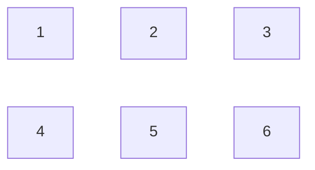

Structural building focuses on how to create the base structure of a building.
Rather than creating a 5x7 house over and over again, many creators use
different structural builds to keep enough diversity around. Some builds are
L-shape, others have several layers to them. There are buildings with a
cross-shape, and others focus more on interconnected buildings.

Some content creators have even perfected the art of creating diagonal
buildings or slightly rotated ones (e.g. builds that are 30 degrees from the
standard lines).

To keep things diverse, I am looking for some randomization in the builds that
I create.

# Using DnD-style crafting lists

In DnD world building, one way of creating new worlds is to use
crafting/building generations based on the roll of a dice. So why not apply the
same to Minecraft builds?

## Building size

The first thing I want to settle on is how big a building should be. Now, if
there is a specific purpose for the building I might skip this step, but I find
myself often creating same-sized buildings (e.g. in villages and hamlets),
mostly looking into 9x9-ish size. After a while, that becomes a bland size...

So, what I do is use a width and length based on `4 + 1d6` (meaning, throw one
6-sided die and add the results to 4). This gives the width and length, but
excluding possible extrusions and decorations. A roof that expands one block
thus is not included in this size - it is meant for the foundation(s) of a
build.

## Grid size

Next, I want to deduce the grid size. This is like the width and height, and
are combined with the building size from earlier on.

For regular houses, I use `1d4` for width and height each. So if I throw a 3
and a 2, then I would get a 3x2 grid, which would look like so:

```
+---+---+---+
|   |   |   |
+---+---+---+
|   |   |   |
+---+---+---+
```



## Cell builds

Next, for each cell in the grid, I throw the dice to see if that cell will
contain a house unit (which is a bit like a room, although the final house
might not use each cell as a separate room - it depends on the constraints
given like the size.

- For the ground floor, the cell gets a unit if `1d4` is 1, 2 or 3.
- For the first level, the cell gets a unit if `1d4` is 1 or 2.
- For the second level, the cell gets a unit if `1d4` is 1.

Hence, houses will get at most 3 layers.

As an example, using the 3x2 grid, let's say for the ground floor I had the
values 2, 1, 2, 4, 2 and 4. Hence, the ground floor would have units like so:

```
+---+---+---+
| 2 | 1 | 2 |
+---+---+---+
  4 | 2 | 4
    +---+
```

The first floor gets 1, 2, 3, 2, 4 and 4, so:

```
+---+---+
| 1 | 2 | 3
+---+---+
| 2 | 4   4
+---+
```

The third floor gets 1, 1, 4, 3, 4 and 2, so:

```
+---+---+
| 1 | 1 | 4
+---+---+
  3   4   2
```

You might wonder, the second floor has a unit on top of nothing? Indeed, that
gives an area where you have a roof but are otherwise still outside. I might
use that location as a workspace for a blacksmith for instance.

## Unit sizes

Next I want to assign the size of each unit. This takes into account the total size.


## Unit modifiers

Next, I look if a unit should be modified. Modifiers here are about placement
in the three dimensions: horizontal (flat plan) and vertical (height).

The result of the shifting might not always make sense, but it gives for some
nice random ideas to work with.

### Modify horizontally

First, on the plane, I want to know if I have to shift a unit. I use `1d4` to
see if I need to shift it. A value of 1 or 2 means that it stays where it is. A
value of 3 means to shift one block, whereas a value of 4 means two blocks.

If I have to shift, then I use a `1d8` to find the direction. The direction is
based on the following map:

```
 8  1  2
 7  x  3
 6  5  4
```

So basically, a 1 means the unit shifts backwards, whereas a 4 means forward and sideways. Or, using a compass-alike view, it means:

| Number | Direction  |
|:-------|:-----------|
| 1      | North      |
| 2      | North-East |
| 3      | East       |
| 4      | South-East |
| 5      | South      |
| 6      | South-West |
| 7      | West       |
| 8      | North-West |

### Modify vertically

Then the same is done with vertical shifts, using the same method:

- First `1d4` to see if I do want to stay as-is (1, 2), shift one block (3) or two blocks (4)
- Next, if I need to shift, `1d8` with the value giving the direction to shift.

